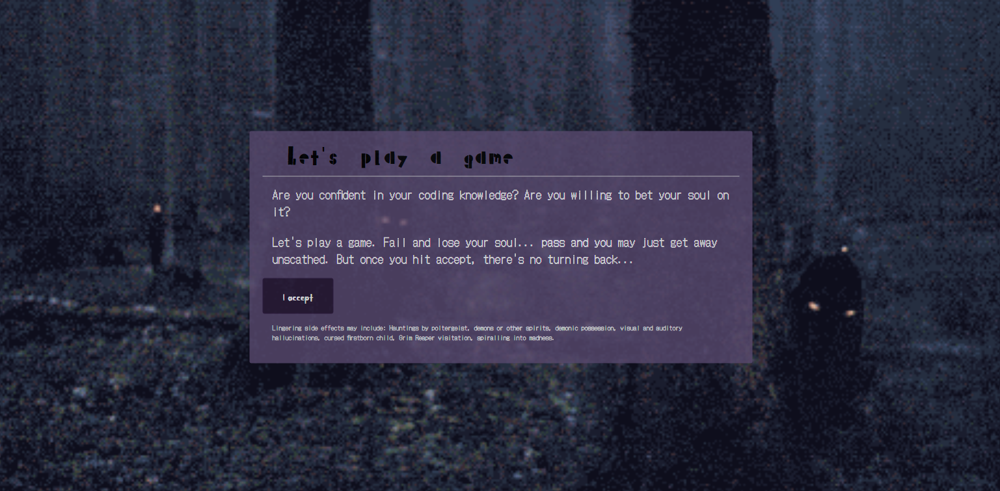

# Web APIs: Code Quiz

## by Sophia De La Rosa

This quiz displays one question at a time using a function to replace the main content with question items in an array. Points are tallied and your score is shown at the end. You can input your initials and the initials and score are added to a highscore board from local storage. A timer starts at the beginning of the quiz, and when it reaches zero, the endQuiz() function is called.

Deployed application link: https://sophiadelarosa.github.io/04-Code-Quiz/

Github link: https://github.com/sophiadelarosa/04-Code-Quiz

## Mock-Up

The following photo demonstrates the application functionality:

Known bugs:
* The endQuiz() function currently does not stop the timer.
* One quiz question overlaps the textbox.
* Background covers the width of the window but not the height.
* Highscores currently show in one line separated by a comma; a for loop is needed to show the local storage data string as list items.
